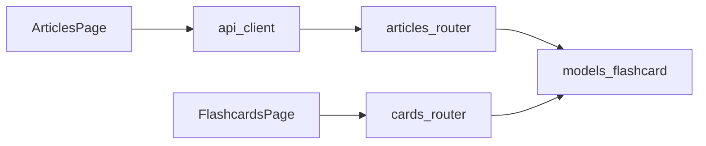

# Artigos → Anki (import para flashcards)

> Mapa do subgrafo que liga a página de artigos ao modelo `FlashCard` e à revisão SM-2: import cria cartões com frente/verso utilizáveis na fila.

## Ficheiros no raio (só paths)
- `backend/app/routers/articles.py`
- `backend/app/schemas.py`
- `backend/app/models.py`
- `backend/app/routers/cards.py`
- `backend/app/services/sm2.py`
- `frontend/src/pages/ArticlesPage.tsx`
- `frontend/src/api/client.ts`
- `frontend/src/pages/FlashcardsPage.tsx`

## Nós (slug + ficheiro + o que procurar)
- **[[articles_router]]** — `backend/app/routers/articles.py` — Procurar: `@router.post("/import")`, `ArticleImportBody`, `FlashCard(front=`, `back=`
- **[[schemas_articles]]** — `backend/app/schemas.py` — Procurar: `ArticleImportBody`, `ArticlePhraseItem`, `ArticleImportResult`
- **[[models_flashcard]]** — `backend/app/models.py` — Procurar: `class FlashCard`, `front`, `back`, `source`
- **[[cards_router]]** — `backend/app/routers/cards.py` — Procurar: `create_card`, `POST ""`, `review_card`, `/due`
- **[[sm2_service]]** — `backend/app/services/sm2.py` — Procurar: intervalos após `quality`
- **[[ArticlesPage]]** — `frontend/src/pages/ArticlesPage.tsx` — Procurar: `importArticlePhrases`, estado dos campos palavra/contexto
- **[[api_client]]** — `frontend/src/api/client.ts` — Procurar: `importArticlePhrases`, `POST /api/articles/import`
- **[[FlashcardsPage]]** — `frontend/src/pages/FlashcardsPage.tsx` — Procurar: `card.front`, `card.back`, `Mostrar verso`

## Relações (arestas)
- [[ArticlesPage]] → [[api_client]] | call — `ArticlesPage.tsx` → `client.ts`
- [[api_client]] → [[articles_router]] | HTTP POST — corpo JSON `items` / legado `phrases`
- [[articles_router]] → [[models_flashcard]] | persist — cria linhas `flashcard`
- [[FlashcardsPage]] → [[cards_router]] | HTTP GET/POST — `/api/cards/due`, `/review`
- [[cards_router]] → [[sm2_service]] | call — atualização após revisão

## Hubs e pontes
- **[[models_flashcard]]** — `backend/app/models.py` — Procurar: `FlashCard` — hub de dados entre import e revisão
- **[[articles_router]]** — `backend/app/routers/articles.py` — Procurar: `import` — ponte artigo → deck local

## Riscos / perguntas de review (opcional, curto)
- Garantir que `back` com contexto longo continua legível na revisão (FlashcardsPage só mostra texto).

## Mermaid (opcional; ≤20 nós)

